# Environmental Sound Classification

<div align="center">
  
  
  
  
  
</div>

## Table of Contents
1. [Project Overview](#1-project-overview)
2. [Dataset](#2-dataset)
3. [Audio Preprocessing Pipeline](#3-audio-preprocessing-pipeline)
4. [Feature Extraction with Librosa](#4-feature-extraction-with-librosa)
5. [Training Workflow](#5-training-workflow)
6. [Models' Architectures Compared](#6-models-architectures-compared)
7. [Performance Showdown](#7-performance-showdown)
8. [Dependencies](#8-dependencies)
9. [Authors](#9-authors)

## 1. Project Overview
The goal of this project is to implement and compare deep learning models for classifying environmental sounds using the UrbanSound8K dataset. We evaluate RNNs, LSTMs, Transformers, and a novel CNN-LSTM hybrid architecture.

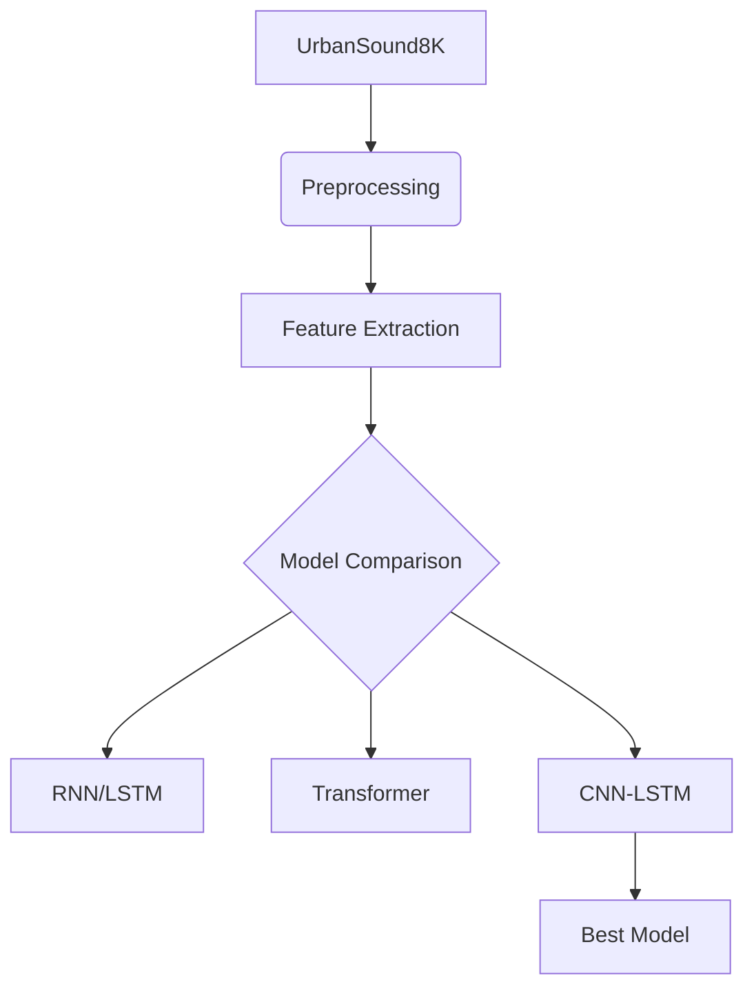

## 2. Dataset 
**UrbanSound8K Dataset**: 8732 real-world audio clips across 10 environmental categories

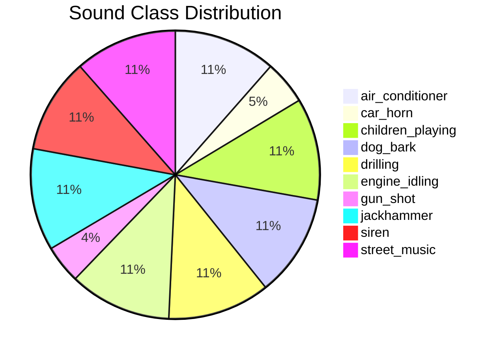

## 3. Audio Preprocessing Pipeline
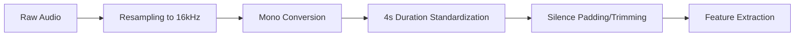

1. **Resampling** 
   All audio → 16,000 Hz (Nyquist theorem compliant: captures up to 8,000 Hz)
   
2. **Mono Conversion**  
   Multi-channel → Single channel for efficient processing
   
3. **Duration Standardization**  
   Fixed 4-second clips:
   - Short clips: Padded with silence
   - Long clips: Intelligently trimmed

## 4. Feature Extraction with Librosa
**Three audio representations** extracted using Librosa:

| Feature | Purpose | Visualization |
|---------|---------------|--------------|
| **Mel Spectrogram** | Captures frequency patterns similar to human hearing |  |
| **MFCCs** | Compact representation of spectral characteristics |  |
| **Energy (RMS)** | Measures loudness dynamics over time |  |

**Some Observed Class Characteristics**:
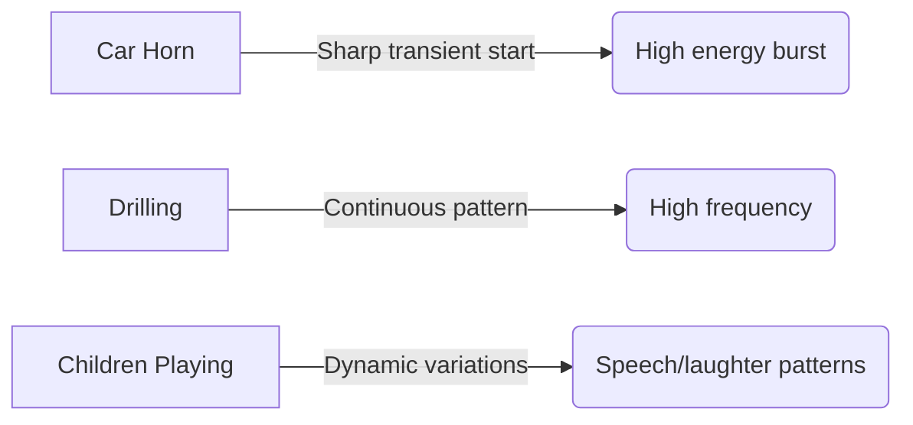

## 5. Training Workflow
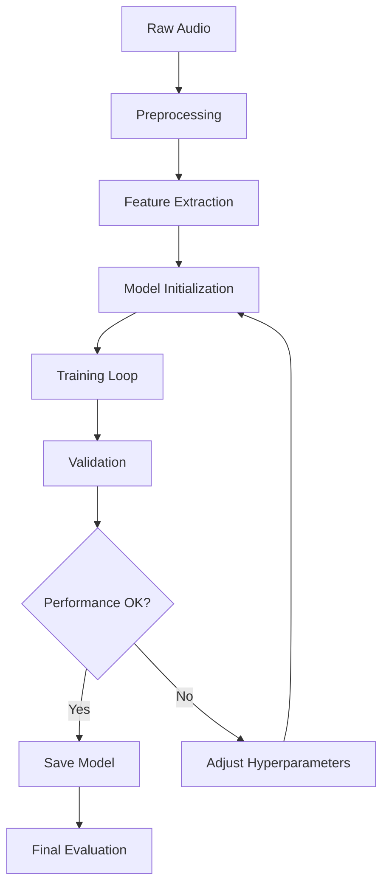

## 6. Models' Architectures Compared

### RNN/LSTM Models
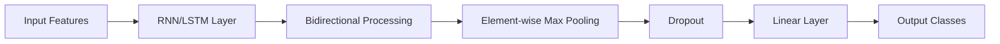

**RNN Architecture**:
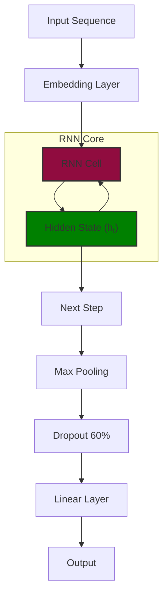
**LSTM Architecture**:
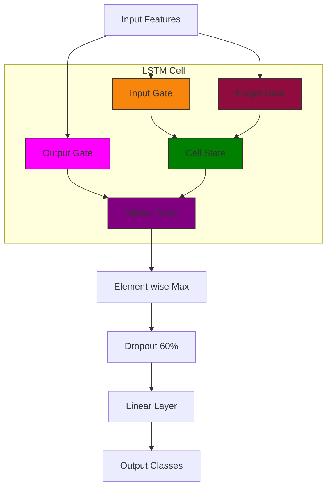

**Hyperparameter Optimization**:
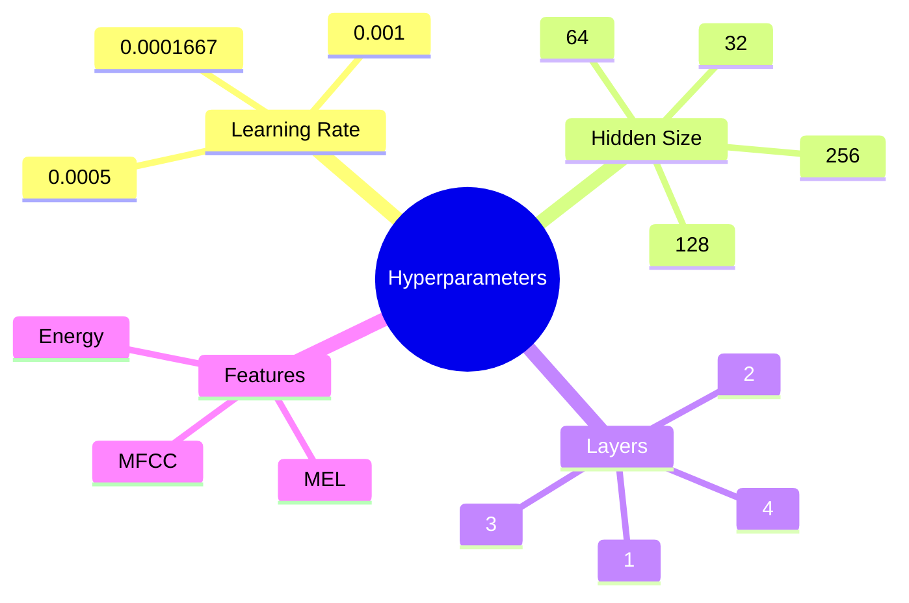

**RNN vs LSTM Comparison**:
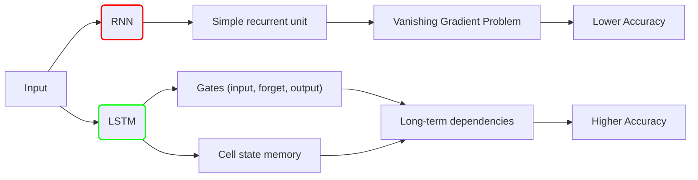

### Transformer Model
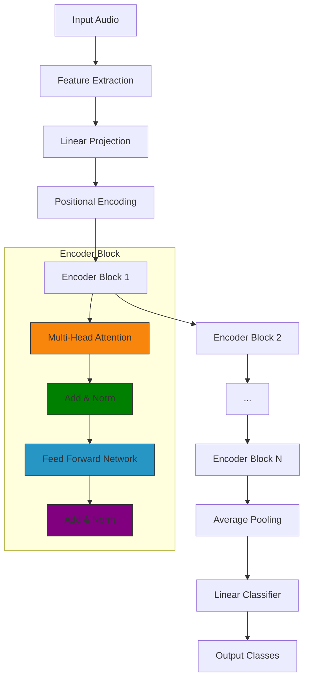

**Hyperparameter Configuration**:
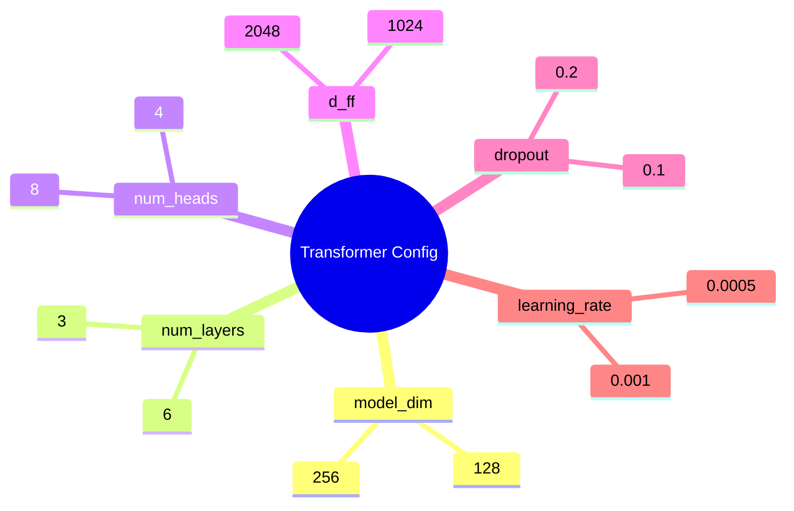

### CNN-LSTM Hybrid (Best Model)
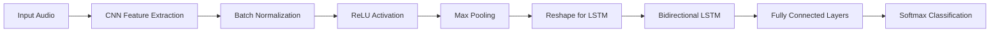

**Hyperparameter Search**:
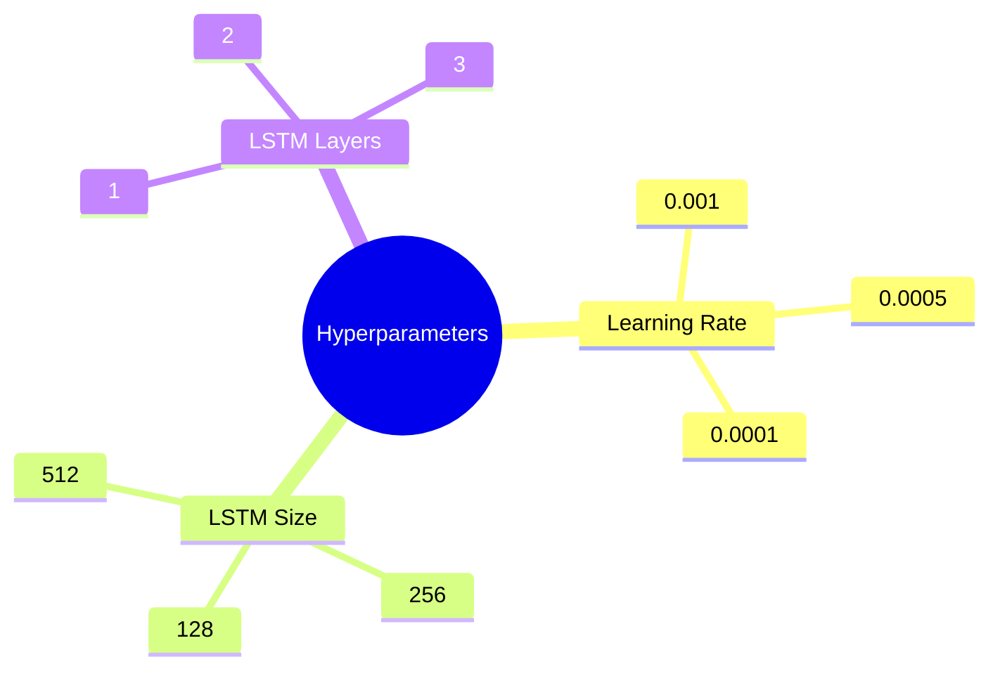

## 7. Performance Showdown
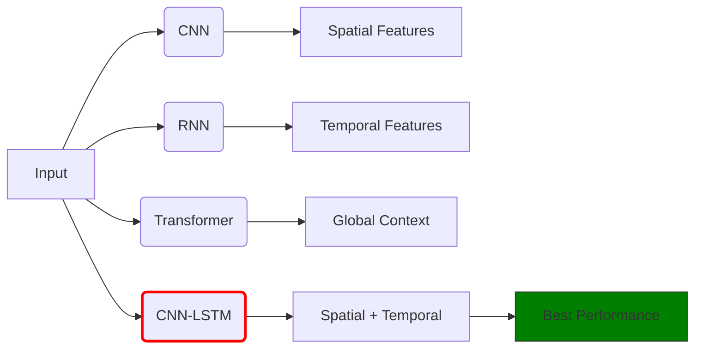

| Model         | Feature   | Test Accuracy | F1-Score | Confused Class     |
|---------------|-----------|---------------|----------|--------------------|
| RNN           | Energy    | 49.34%        | 0.5071   | Jackhammer         |
| RNN           | **MEL**   | **66.00%**    | **0.6964** | Air Conditioner    |
| RNN           | MFCC      | 59.41%        | 0.6002   | Air Conditioner    |
| Transformer   | Energy    | 35.63%        | 0.3161   | Drilling           |
| Transformer   | **MEL**   | **66.42%**    | **0.6919** | Jackhammer         |
| Transformer   | MFCC      | 64.61%        | 0.6520   | Air Conditioner    |
| CNN-LSTM      | Energy    | 51.60%        | 0.52     | Air Conditioner    |
| CNN-LSTM      | **MEL**   | **🌟 76.95% 🌟** | **0.77** | Air Conditioner    |
| CNN-LSTM      | MFCC      | 69.39%        | 0.71     | Drilling           |

**Confusion Matrix (CNN-LSTM with MEL)**:


**Key Findings**:
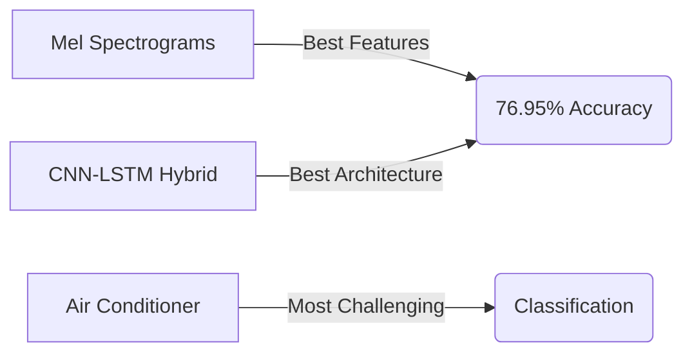

## 8. Dependencies
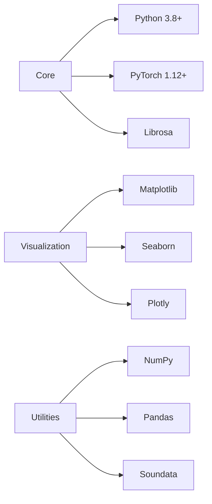

```bash
pip install torch==1.12.0 librosa==0.10.0 matplotlib seaborn plotly numpy pandas soundata
```

## 9. Authors
- Hager Ashraf Mohamed Melook  
- Nouran Ashraf Yousef  
- Rana Mohamed Ali Attia
